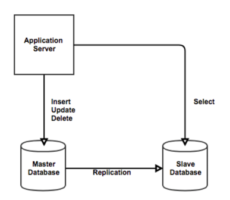

# DB Replication
사용자는 점점 많아지고 Database는 많은 Query를 처리하기엔 너무 힘든 상황이 오게 된다.

Query의 대부분을 차지하는 Select를 어느 정도 해결하기 위해 Replication이란 방법이 나오게 되었다.

## Replication이란?
두 개의 이상의 DBMS 시스템을 Mater / Slave로 나눠서 동일한 데이터를 저장하는 방식이다.

Master DBMS에는 데이터의 수정사항을 반영만하고 Replication을 하여 Slave DBMS에 실제 데이터를 복사한다.

## Transactional(readOnly = "true")와의 연관성
아무 영향도 안 끼치는데 굳이 왜 readOnly를 붙이는가?라고 생각할 수 있지만
슬레이브 DB에서 처리하라고 명시적으로 알려주기 위함이라고 한다!

# Reference
학습 로그 토론: 에어
https://nesoy.github.io/articles/2018-02/Database-Replication